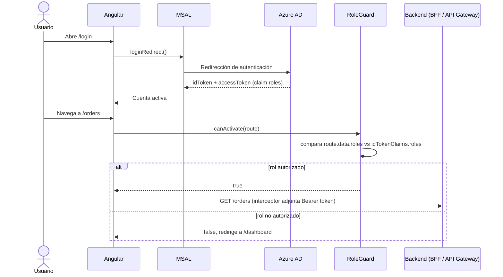
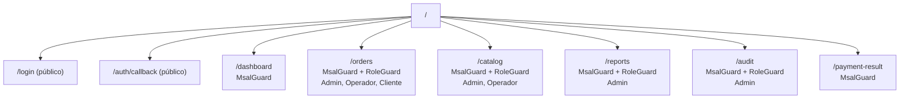

# Pedidos360 — Frontend

Portal web de la plataforma logística Pedidos360: panel administrativo, gestión operativa y seguimiento de compras, con autenticación corporativa federada y vistas diferenciadas por rol.

Este repositorio contiene únicamente el frontend. El backend de microservicios vive en un repositorio separado: [`pedidos360-backend`](https://github.com/meninaaa/pedidos360-backend).

## Stack tecnológico

| Área | Tecnología |
|---|---|
| Framework | Angular 18 (standalone components) |
| Autenticación | MSAL Angular — Azure AD / Entra ID, `InteractionType.Redirect` |
| Autorización | `MsalGuard` (sesión activa) + `RoleGuard` (rol por ruta) |
| Visualización de datos | Chart.js |
| Pagos | Transbank Webpay Plus (redirección server-side vía formulario POST) |
| Gestor de paquetes | pnpm |

## Diagramas

### Autenticación y autorización



### Árbol de rutas y guards



### Flujo de pago Webpay (lado cliente)

```mermaid
sequenceDiagram
    actor Cliente
    participant Orders as OrdersComponent
    participant API as Backend
    participant TBK as Transbank
    participant Result as PaymentResultComponent

    Cliente->>Orders: Click "Pagar"
    Orders->>API: POST /payments/create?amount&orderId
    API-->>Orders: { url, token_ws }
    Orders->>Orders: redirigirATransbank() crea <form> y hace submit()
    Orders->>TBK: POST (token_ws) vía formulario
    TBK-->>Cliente: Formulario de pago Webpay
    Cliente->>TBK: Ingresa datos de tarjeta
    TBK->>API: POST /payments/commit (servidor a servidor vía navegador)
    API-->>Cliente: Redirect /payment-result?status=success
    Cliente->>Result: Ve confirmación del pago
```



## Roles y vistas

| Rol | Dashboard | Pedidos | Catálogo | Reportería | Auditoría |
|---|---|---|---|---|---|
| **Admin** | KPIs globales (ventas, pedidos activos, usuarios activos) | Gestión total, cambio de estado | CRUD completo | Gráficos completos (ventas/hora, lead time, top productos) | Timeline con filtros |
| **Operador** | Pedidos en curso y pendientes | Aceptar / Preparar / Despachar | CRUD completo | Sin acceso | Sin acceso |
| **Cliente** | Sus últimos pedidos y estado actual | Crear pedido propio, pagar con Webpay | Sin acceso | Sin acceso | Sin acceso |

## Componentes principales

| Componente | Ruta | Responsabilidad |
|---|---|---|
| `LoginComponent` | `/login` | Botón de acceso corporativo Microsoft. |
| `DashboardComponent` | `/dashboard` | Resumen diferenciado por rol; para Admin llama a `/reports/summary` y a `/orders` para contar usuarios únicos. |
| `OrdersComponent` | `/orders` | Listado filtrado por rol (`/orders`, `/orders/pending`, `/orders/customer`), creación de pedidos, cambio de estado, botón de pago Webpay. |
| `CatalogComponent` | `/catalog` | CRUD de productos. |
| `ReportsComponent` | `/reports` | KPIs en vivo + `SalesChartComponent`, `LeadTimeChartComponent`, `TopProductsChartComponent` (Chart.js). |
| `AuditComponent` | `/audit` | Timeline de eventos con filtros por actor, fecha y tipo. |
| `PaymentResultComponent` | `/payment-result` | Pantalla de confirmación post-Webpay, lee `status` de los query params. |
| `RoleGuard` | — | Compara `route.data.roles` contra `idTokenClaims.roles`; si no coincide, redirige a `/dashboard`. |

## Autenticación y seguridad

- El flujo usa `InteractionType.Redirect` configurado en `MSALGuardConfigFactory`.
- El `MsalInterceptor` adjunta automáticamente el JWT a toda llamada cuya URL calce con una entrada del `protectedResourceMap`, definido en `MSALInterceptorConfigFactory` dentro de `app.config.ts`.
- `RoleGuard` es genérico: no tiene roles hardcodeados — lee el arreglo `data: { roles: [...] }` de cada ruta en `app.routes.ts` y lo compara contra el claim `roles` del token. Los valores usados en todo el proyecto son, en español y con mayúscula inicial: `Admin`, `Operador`, `Cliente` (deben coincidir exactamente con lo emitido por Azure AD).

## Configuración de entorno

```typescript
// src/environments/environment.ts
export const environment = {
  production: false,
  apiUrl: 'http://localhost:8080/api/bff'
  // apiUrl: 'https://<api-id>.execute-api.<region>.amazonaws.com/api/bff' // AWS
};
```

El `protectedResourceMap` en `app.config.ts` debe apuntar al mismo dominio que `environment.apiUrl`, o el interceptor no adjuntará el token y las llamadas fallarán con 401 aunque el usuario esté autenticado.

## Requisitos

- Node.js 20+ y pnpm.
- App Registration de Azure AD configurada con `clientId`, `redirectUri` y los roles de aplicación (`Admin`, `Operador`, `Cliente`).

## Ejecución local

```bash
git clone https://github.com/meninaaa/pedidos360-frontend.git
cd pedidos360-frontend
pnpm install
pnpm run start
```

Disponible en `http://localhost:4200`. Requiere que el backend (local o AWS) esté corriendo y que `environment.ts` apunte al destino correcto.

## Estructura del repositorio

```
src/app/
├── core/
│   └── guards/
│       └── role.guard.ts
├── features/
│   ├── login/
│   ├── dashboard/
│   ├── orders/
│   │   └── payment-result.component.ts
│   ├── catalog/
│   ├── reports/
│   │   ├── sales-chart.component.ts
│   │   ├── lead-time-chart.component.ts
│   │   └── top-products-chart.component.ts
│   └── audit/
├── app.config.ts
├── app.routes.ts
└── auth-config.ts
```

## Observaciones del estado actual

- `TopProductsChartComponent` depende de que el backend exponga un endpoint de agregación por producto; esto requiere un modelo `OrderItem` (pedido → producto → cantidad) en `ms-pedidos360-orders`, que no formaba parte del modelo original de `Order` (solo `total` agregado). Si el gráfico ya muestra datos reales en producción, su documentación de endpoint debe agregarse en el README del backend.
- La identificación de "mis pedidos" para el rol Cliente se hace por el claim `name`/email del token contra el campo `customerId` del pedido (texto libre), no por un `userId` estable — ver la observación equivalente en el README del backend.
- `environment.ts` requiere edición manual para alternar entre local y AWS; no hay todavía un mecanismo de build por ambiente (`environment.prod.ts` con `fileReplacements` en `angular.json`).
